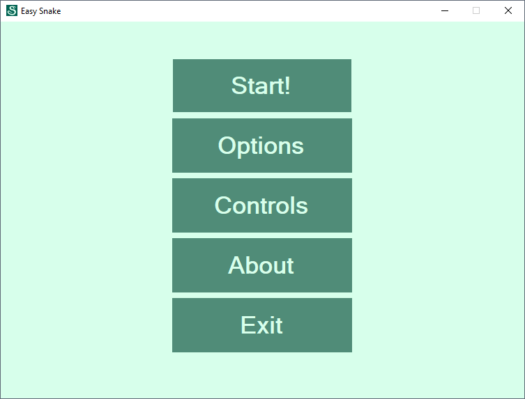
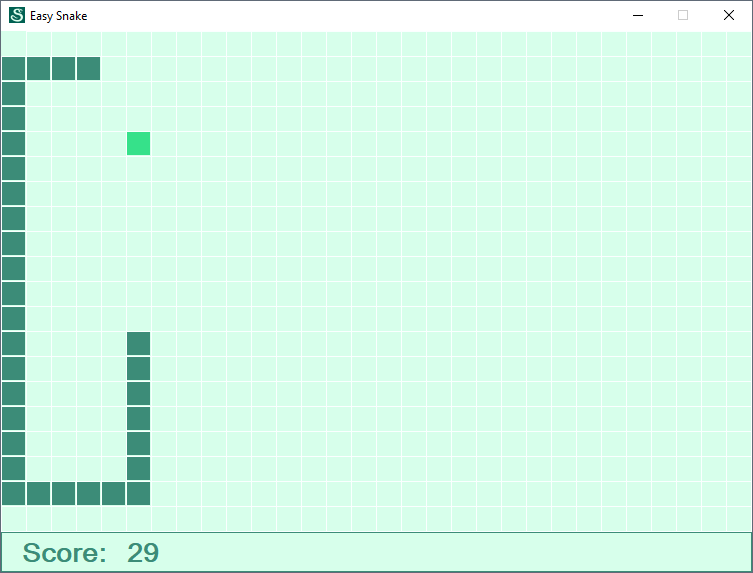
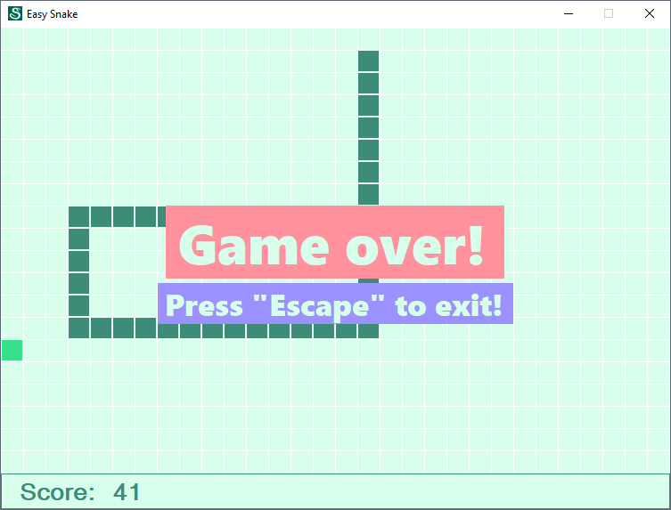

## Easy Snake

Easy Snake is a game in C#!

Created in 2013 with VS2012 as a part of the CGI course.

Compiled binary is included, see the [Easy-Snake-compiled-binary.zip](Easy-Snake-compiled-binary.zip) file.

### Screenshots







### Deploy

```shell script
git clone https://github.com/peterdee/easy-snake
cd ./easy-snake
```

### Requirements

- Windows 7 / 8 / 10 OS

- Visual Studio Community 2019 (though I guess any modern VS version will work)

